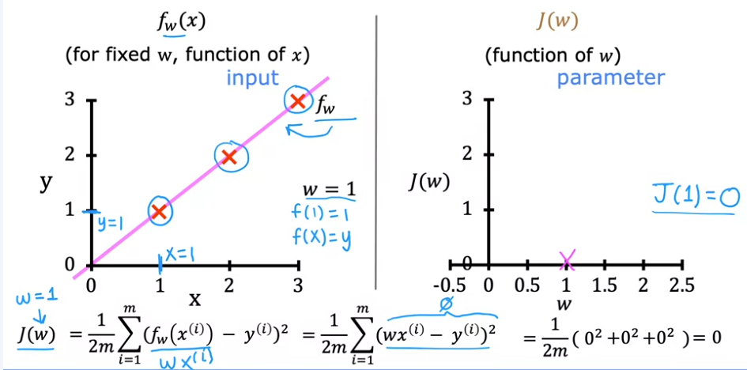
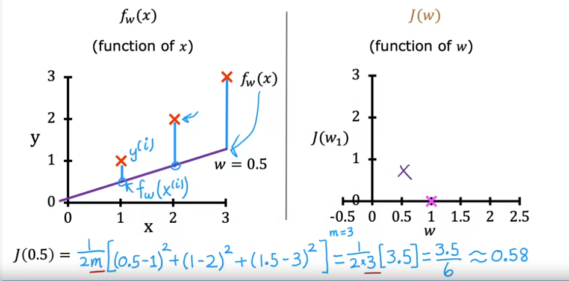
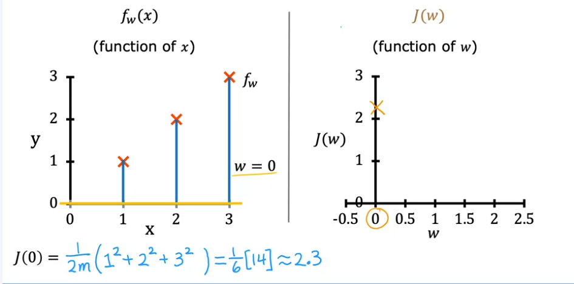

# Understanding the Cost Function in Linear Regression

In this example, we’ll build intuition for what the cost function really does in linear regression. We’ll use a simplified version of the model to see how the cost function helps us find the best parameters for fitting our data.

## Model and Parameters

- **Model function:** $f_{w,b}(x) = w \cdot x + b$
  - **Parameters $w$ and $b$**: Control the line's position and slope
- By adjusting $w$ and $b$, we get different lines to fit the training data.
- **Goal:** Find values for $w$ and $b$ so that the line fits the data as well as possible. (Minimise $J$ as a function of $w$ and $b$)

## Cost Function, $J$

The cost function, $J$, measures the difference between the model’s predictions and the actual target values for $y$. Linear regression finds values of $w$ and $b$ to make $J$ as small as possible. Mathematically, we want to minimize $J(w, b)$.

### Simplified Model

To better understand, let’s simplify by setting $b = 0$, giving us:

$
f_w(x) = w \cdot x
$

Now we only have one parameter, $w$, and the cost function is now $J(w)$, focusing solely on $w$ to minimize errors.

### Visualizing $f_w(x)$ and $J(w)$

1. **Graphing $f_w(x)$ and $J(w)$**: Let’s plot $f_w(x)$ and $J(w)$ side-by-side.
   - Left graph: $f_w(x)$ where the horizontal axis is $x$ and vertical axis is $y$.
   - Right graph: $J(w)$ where the horizontal axis is $w$ and vertical axis is $J$.

2. **Example Points**: Let’s use three training points: (1, 1), (2, 2), and (3, 3).

3. **Evaluating Different $w$ Values**:
    - **When $w = 1$**:
      - $f_w(x)$ fits perfectly through the points, giving a cost $J(1) = 0$ since all squared errors are zero.
      - This plots $J(w)$ at $(w = 1, J = 0)$.
      
    - **When $w = 0.5$**:
      - $f_w(x)$ underestimates $y$ for each point, resulting in a cost $J(0.5) = 0.58$.
      - This shows a point on $J(w)$ at $(w = 0.5, J = 0.58)$.
      
    - **When $w = 0$**:
      - $f_w(x)$ is a horizontal line at zero, with a larger error for each point, resulting in $J(0) = 2.33$.
      

4. **Continuing for Other $w$ Values**: If $w$ were negative (e.g., $w = -0.5$), $J$ increases even more.

5. **Goal**: Minimize $J(w)$ by finding the best $w$. In this example, **$w = 1$ gives the smallest $J(w) = 0$**, which is the best fit for our data.

## Summary

- Each choice of $w$ defines a line $f_w(x)$ and a corresponding point on $J(w)$.
- **Objective of linear regression**: Find parameters $w$ and $b$ that minimize $J$, giving the best fit line for the data.
- In a more complex model, both $w$ and $b$ would vary, visualized in 3D.

In the next steps, we’ll explore a more advanced visualization of $J(w, b)$ in 3D.
