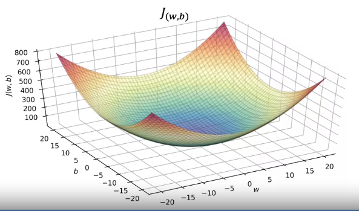
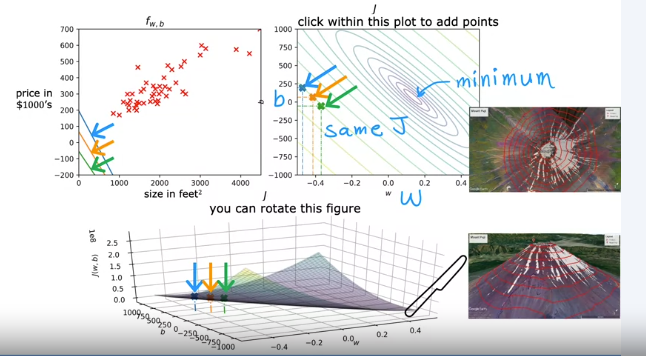

# Cost Function Visualization in Linear Regression

In this section, we explore a more detailed visualization of the **cost function** $J(w, b)$, which measures how well our linear model fits the data. Our goal in linear regression is to **minimize the cost function** by adjusting the parameters $w$ and $b$.

## Key Concepts

- **Model Parameters**: $w$ (weight) and $b$ (bias) are the parameters of the model.
- **Cost Function $J(w, b)$**: Measures the error between predicted values and actual data points.
- **Goal**: Minimize $J(w, b)$ over parameters $w$ and $b$ to achieve a good fit for the data.

### Visualization Approaches

1. **2D Cost Function Plot (Single Parameter $w$)**
   - When we set $b = 0$, the cost function with only $w$ is a **U-shaped curve** (like a "soup bowl").
   - This shape represents the cost as we vary $w$ alone.

2. **3D Cost Function Plot (Two Parameters $w$ and $b$)**
   - With both $w$ and $b$, the cost function forms a **3D surface**.
   - The shape resembles a **3D bowl** or **hammock**.
   - Each point on this surface corresponds to a specific combination of $w$ and $b$, with the height representing the cost value $J(w, b)$.

### Contour Plot Visualization

A **contour plot** offers a different view of $J(w, b)$:

- **Definition**: A contour plot shows the cost function $J(w, b)$ as **horizontal slices** of the 3D surface.
- **Interpretation**:
  - Each oval (ellipse) represents points at the **same height** (same cost $J$) on the 3D surface.
  - As you move closer to the center, the cost decreases, indicating better parameter values.
  - The **center of the concentric ovals** represents the **minimum** of $J$ (lowest cost).

> **Analogy**: Imagine viewing the 3D "bowl" from above, flattening it into 2D. Each ellipse in the contour plot corresponds to a "height" level on the bowl.

## Practical Example

- When plotting housing prices:
   - **Poor models** (like those with certain values of $w$ and $b$) yield higher cost values, shown as points further from the center in the contour plot.
   - The **optimal model** with minimal cost is located at the center of the smallest ellipse.
