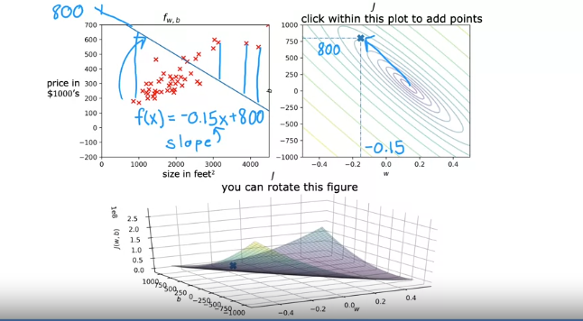

# Visualizing Parameters $w$ and $b$

## Example 1
Here's an example of a point on the cost function $J$ for specific values of $w$ and $b$:
- **$w = -0.15$** and **$b = 800$**
- This choice for $w$ and $b$ corresponds to a function $f(x) = -0.15x + 800$, represented by the line on the left.

Since **$b = 800$**, the line intersects the vertical axis at 800, and since **$w = -0.15$**, the slope is negative.

- **Observation:** This line **does not fit the data well**; many predictions $\hat{y}$ are far from actual values $y$.
  - The cost $J(w, b)$ for this line is relatively high because this choice of $w$ and $b$ yields a poor fit to the data.

## Example 2
Now, let's look at a different pair of parameters:

- **$w = 0$** and **$b \approx 360$**
- Corresponds to a function $f(x) = 0 \cdot x + 360$

This results in a **flat line** at 360, which also doesn’t match the data well.

- **Observation:** The cost function $J(w, b)$ for this line is still high but **closer to the minimum than the previous example**.

## Example 3
Another choice for $w$ and $b$:

- The **line $f(x)$** for this choice is **further from the minimum** of the cost function $J(w, b)$.
  - The **center of the smallest ellipse** in the cost function plot marks the minimum.

## Example 4 (Closer Fit)
This example uses a pair of parameters that yield a **better fit line** to the data.

- On the cost plot, the point for this line **lies near the center of the smallest ellipse** (close to the minimum cost).
- For this line $f(x)$:
  - The **vertical distances** (errors) between predictions $\hat{y}$ and actual values $y$ are minimized.
  - The **sum of squared errors** is close to the minimum possible.

**Key Takeaway:** 
- **Better fit lines** correspond to points on the cost function graph that are **closer to the minimum cost**.

---

## Optional Lab

In the optional lab, you will:
1. **Run code** to see the cost function in action.
   - Given different choices for parameters, see how the **cost varies** depending on model fit.
2. **Use an interactive contour plot:**
   - Click on any point to see the line defined by $w$ and $b$ values.
   - View a dot on the 3D surface plot representing the cost for that point.
3. **Rotate a 3D surface plot** to visualize the cost function.

---

# Introducing Gradient Descent

Finding the **best fit line** manually by reading a contour plot for $w$ and $b$ isn’t efficient, especially for complex models.

## Solution: Gradient Descent
- **Gradient descent** is a core algorithm for **automatically minimizing the cost function $J$** by finding optimal $w$ and $b$ values.
- This algorithm is fundamental to training not only linear regression but also **advanced AI models**.

In the next video, we’ll explore this important algorithm, **gradient descent**.
