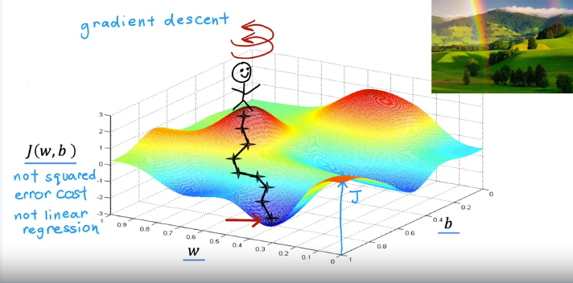
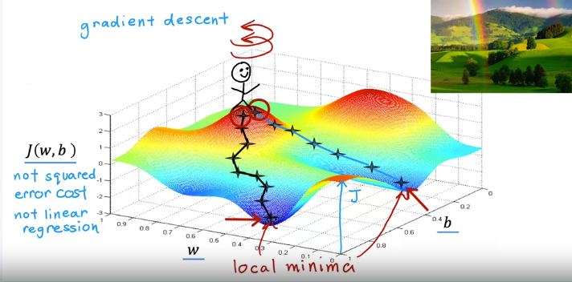

# Gradient Descent Algorithm

We discussed visualizations of the cost function $j$ and how different choices of the parameters $w$ and $b$ affect the cost. Now, we'll explore a systematic approach to find values of $w$ and $b$ that minimize the cost, $j(w, b)$. This approach is known as **gradient descent**.

## Overview of Gradient Descent
- Gradient descent is widely used in machine learning, including for training advanced neural network models (deep learning).
- Learning gradient descent is essential for understanding key building blocks in machine learning.

### Cost Function
- The objective is to minimize the cost function $j(w, b)$.
- Gradient descent can be applied to any function, not just the cost function for linear regression.

### Generalization
- Gradient descent applies to more complex cost functions, such as $J(w_1, w_2, \ldots, w_n, b)$, where the goal is to minimize $j$ over parameters $w_1$ to $w_n$ and $b$.

### Initial Guesses
- Start with initial guesses for $w$ and $b$ (commonly set to 0).
- The algorithm iteratively adjusts $w$ and $b$ to reduce the cost $j(w, b)$.

## Visualization of Gradient Descent
- The surface plot of the cost function $j(w, b)$ can be viewed as a landscape of hills and valleys.
- Imagine standing on a hill and looking for the fastest way to reach the valley (minimum).

### Steps to Gradient Descent
1. **Look Around**: Identify the direction of steepest descent.
2. **Take a Step**: Move a small distance in that direction.
3. **Repeat**: Continue the process until reaching a local minimum.

### Local Minimun
- Starting from different initial points can lead to different local minima.
- The outcome of gradient descent depends on the initial values of $w$ and $b$.

## Conclusion
- In this video, we explored how gradient descent works to minimize the cost function.
- Next, we will delve into the mathematical expressions necessary to implement gradient descent.
