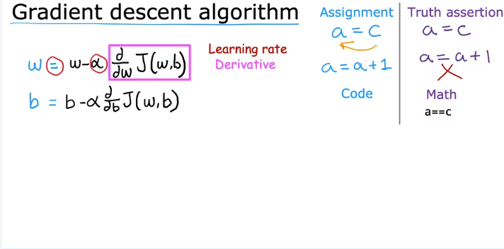
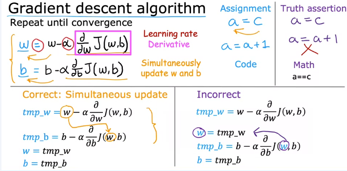

# Implementing Gradient Descent Algorithm

We will look at how to implement the gradient descent algorithm. 

## Gradient Descent Algorithm Overview
The algorithm updates the parameter $w$ as follows:

$$
w = w - \alpha \frac{d}{dw} J(w, b)
$$

- **$w$**: parameter to be updated
- **$\alpha$**: learning rate (a small positive number, typically between 0 and 1)
- **$J(w, b)$**: cost function

> This equation indicates that the current value of $w$ is adjusted by a small amount determined by the derivative of the cost function.

### Understanding the Assignment Operator
- The equal sign ($=$) in this context is the **assignment operator**. 
  - Example: 
    - $a = c$ assigns the value of $c$ to $a$.
    - $a = a + 1$ increments the value of $a$ by one.
  
### Learning Rate ($\alpha$)
- The learning rate controls the size of the steps taken during the gradient descent:
  - Large $\alpha$: aggressive updates (big steps downhill)
  - Small $\alpha$: conservative updates (small baby steps downhill)
  
### Derivative Term
- The derivative $\frac{d}{dw} J(w, b)$ indicates the direction to adjust $w$.
- Derivatives are derived from calculus, but understanding them at a high level is sufficient for implementing gradient descent.

## Updating Parameters
- For the model, both parameters $w$ and $b$ need to be updated:
  
$$
b = b - \alpha \frac{d}{db} J(w, b)
$$

### Convergence
- Gradient descent repeats the updates until the algorithm converges, meaning $w$ and $b$ stabilize at local minima.

### Simultaneous Updates
- It is crucial to update both $w$ and $b$ simultaneously:

 
#### Correct Implementation:
1. Compute temporary variables:
   - $temp\_w = w - \alpha \frac{d}{dw} J(w, b)$
   - $temp\_b = b - \alpha \frac{d}{db} J(w, b)$
2. Update parameters:
   - $w \gets temp\_w$
   - $b \gets temp\_b$

#### Incorrect Implementation:
- Updating $w$ before calculating the new value for $b$ can lead to errors, as the updated $w$ will affect the derivative calculation.

## Summary
- Use the simultaneous update method for gradient descent.
- Understanding derivatives will be covered in the next video.

In the next video, we will delve deeper into the derivative term essential for implementing gradient descent effectively.
