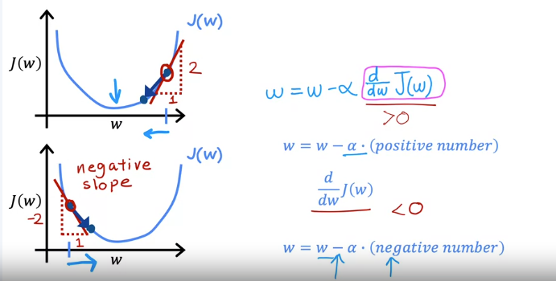

# Understanding Gradient Descent

In this video, we explore gradient descent to develop a better intuition about its mechanics and significance.

## Gradient Descent Algorithm
The algorithm updates parameters $w$ and $b$ using the formula:

$$
w \gets w - \alpha \frac{d}{dw} J(w, b)
$$

- **$\alpha$**: Learning rate
- **$\frac{d}{dw} J(w, b)$**: Derivative term

### Learning Rate ($\alpha$)
- Controls the size of the step taken when updating parameters.
- Affects how quickly or slowly the algorithm converges.

### Derivative Term
- Denoted as $\frac{d}{dw}$, often referred to as the derivative (though it represents the partial derivative in multivariate calculus).

## Simplified Example: One Parameter
To simplify the understanding, we consider a cost function $J(w)$ with just one parameter $w$. The gradient descent equation becomes:

$$
w \gets w - \alpha \frac{d}{dw} J(w)
$$

### Visualizing Gradient Descent
- Graph the cost function $J(w)$ with $w$ on the horizontal axis and $J(w)$ on the vertical axis.
- Choose an initial value for $w$.

#### Example 1: Positive Derivative
- Starting at a point where the derivative is positive:
  - The slope of the tangent line is positive.
  - The update is: 
    $$
    w \gets w - \text{(positive number)}
    $$
  - Result: Decrease in $w$, moving left on the graph, thus reducing the cost $J(w)$.

#### Example 2: Negative Derivative
- Starting at a point where the derivative is negative:
  - The slope of the tangent line is negative.
  - The update becomes:
    $$
    w \gets w - \text{(negative number)}
    $$
  - Result: Increase in $w$, moving right on the graph, thus again reducing the cost $J(w)$.

## Intuition Behind the Derivative
- The derivative helps in determining the direction of the update:
  - Positive slope → decrease $w$ (move left).
  - Negative slope → increase $w$ (move right).

### Key Takeaways
- The derivative term dictates how $w$ is adjusted to move towards the minimum of the cost function.
- The learning rate $\alpha$ is crucial for determining the size of the steps taken during updates.

## Next Steps
- The next video will focus on choosing the learning rate $\alpha$:
  - What happens if it's too small or too large.
  - Strategies for selecting an effective value for $\alpha$ in gradient descent implementations.
